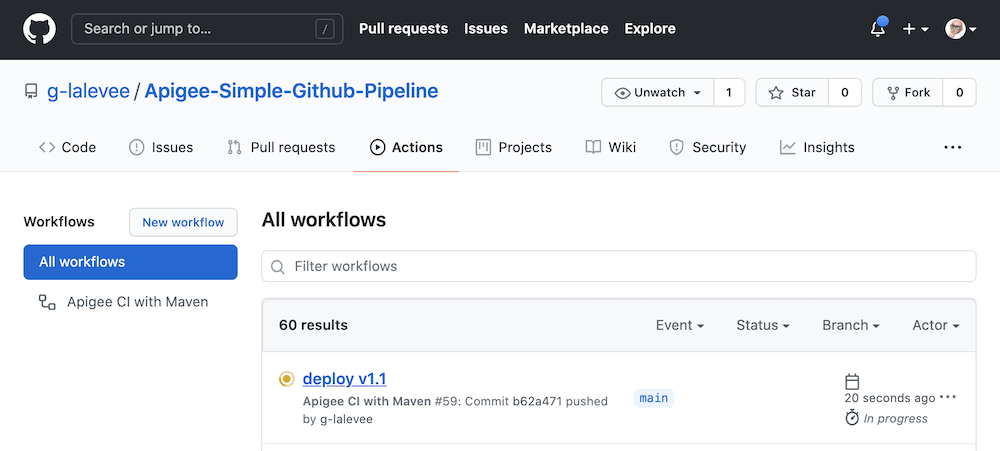
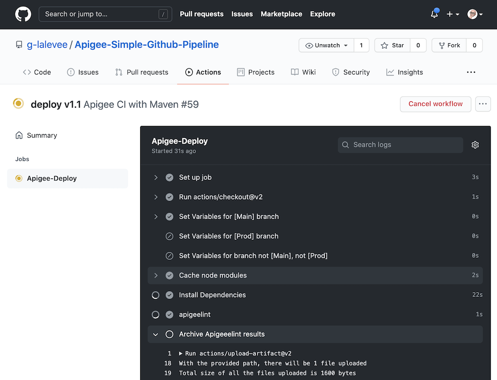
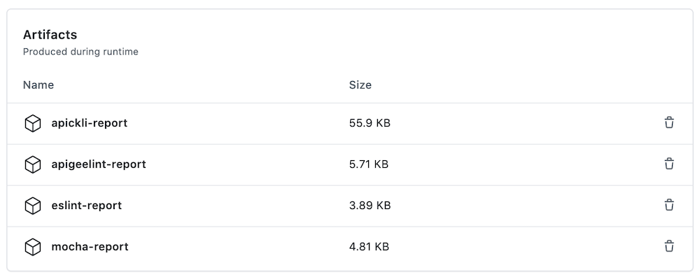
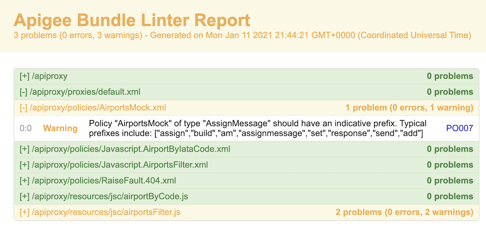

[](https://pypi.python.org/pypi/ansicolortags/) 

# Apigee-Simple-Github-Pipeline

**This is not an official Google product.**<BR>This implementation is not an official Google product, nor is it part of an official Google product. Support is available on a best-effort basis via GitHub.

***

## Goal

Simple implementation for a CI/CD pipeline for Apigee using GitHub repository, 
[CI/CD with GitHub](https://docs.GitHub.com/ee/ci/introduction/) and the Apigee Maven Plugins.

The CICD pipeline includes:

- Git branch dependent Apigee environment selection and proxy naming to allow
  deployment of feature branches as separate proxies in the same environment
- Static Apigee Proxy code analysis using [apigeelint](https://github.com/apigee/apigeelint)
- Static JS code analysis using [eslint](https://eslint.org/)
- Unit JS testing using [mocha](https://mochajs.org/)
- Integration testing of the deployed proxy using
  [apickli](https://github.com/apickli/apickli)
- Packaging and deployment of an Apigee configuration using
  [Apigee Config Maven Plugin](https://github.com/apigee/apigee-config-maven-plugin)
- Packaging and deployment of the API proxy bundle using
  [Apigee Deploy Maven Plugin](https://github.com/apigee/apigee-deploy-maven-plugin)


### API Proxy and Apigee configuration

The folder [./apiproxy](./apiproxy) includes a simple API proxy bundle, a simple Apigee configuration file [./EdgeConfig/edge.json](./EdgeConfig/edge.json) as well as the following resources:

- [GitHub Action Workflow File](.github/workflows/apigee-ci.yml) to define a GitHub Action CI
  multi-branch pipeline.
- [test Folder](./test) to hold the unit and integration
  tests.


## Target Audience

- Operations
- API Engineers
- Security

## Limitations & Requirements

- The authentication to the Apigee management API is done using OAuth2. If
  you require MFA, please see the [documentation](https://github.com/apigee/apigee-deploy-maven-plugin#oauth-and-two-factor-authentication)
  for the Maven deploy plugin for how to configure MFA.


## CI/CD Configuration Instructions

### Initialize a GitHub Repository

Create a GitHub repository to hold your API Proxy. 

To use the `Apigee-Simple-Github_CI-Pipeline`
in a **GitHub** repository `github.com/my-user/my-api-proxy-repo` follow these
steps:

```bash
git clone git@github.com:g-lalevee/Apigee-Simple-Github_CI-Pipeline.git
cd Apigee-Simple-Github_CI-Pipeline
git init
git remote add origin git@github.com:my-user/my-api-proxy.git
git checkout -b feature/cicd-pipeline
git add .
git commit -m "initial commit"
git push -u origin feature/cicd-pipeline
```

 

### GitHub Configuration 

Add GitHub secrets APIGEE_CREDS_USR and APIGEE_CREDS_PSW, to store your Apigee User ID and password:
- Go to your repository’s Settings > Secrets.
- Click the **New Repository Secret** button.<BR>Fill in the details:
  - Name: APIGEE_CREDS_USR
  - Value: your Apigee user ID 
  - Click the **Add secret** button
- Click again the **New Repository Secret** button.<BR>Fill in the details:
  - Name: APIGEE_CREDS_PSW
  - Value: your Apigee user ID password
  - Click the **Add secret** button

## Run the pipeline

Using your favorite IDE...
1.  Update the **.github/workflows/apigee-ci.yml** file<BR>
In **"env"** section (workflow level), change **DEFAULT_APIGEE_ORG** value by your target Apigee organization.
2.  Read carefully the **"Set Variables for [Main] branch"** step to check if the multibranch rules match your GitHub and Apigee environment naming and configuration.
3. Save
4. Commit, Push.. et voila!

Use the GitHub UI to monitor your pipeline execution:

- Go to your GitHub repository > **Actions** (tab). You can see your workflow running.

<BR>

- Click on it to see execution detail. In list of jobs, click on **Apigee-Deploy**.

<BR>

- And the end of execution, you can download artifacts. Click on **Summary** link and scroll down to the **Artifacts** section.

<BR>

- For example, the results of static code analysis for Apigee proxy using Apigeelint (download apigeelint-report.zip file, open html content with your browser):

<BR>
